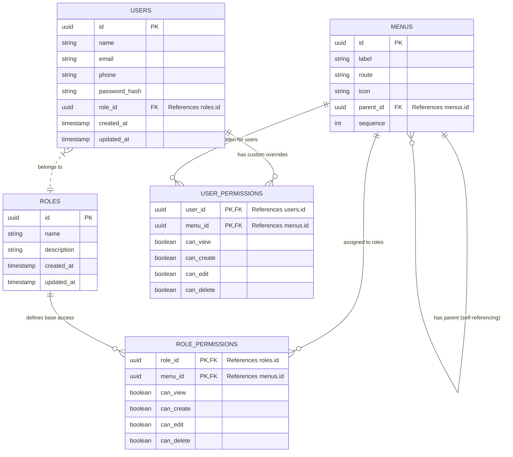

# Database Entity Relationship Diagram (ERD)

Here is a visual flowchart (Entity-Relationship Diagram) showing how the database tables are related based on the proposed backend architecture.

```mermaid
erDiagram
    USERS }|..|| ROLES : "belongs to"
    USERS ||--o{ USER_PERMISSIONS : "has custom overrides"
    
    MENUS ||--o{ MENUS : "has parent (self-referencing)"
    MENUS ||--o{ ROLE_PERMISSIONS : "assigned to roles"
    MENUS ||--o{ USER_PERMISSIONS : "overridden for users"
    
    ROLES ||--o{ ROLE_PERMISSIONS : "defines base access"

    USERS {
        uuid id PK
        string name
        string email
        string phone
        string password_hash
        uuid role_id FK "References roles.id"
        timestamp created_at
        timestamp updated_at
    }

    ROLES {
        uuid id PK
        string name
        string description
        timestamp created_at
        timestamp updated_at
    }

    MENUS {
        uuid id PK
        string label
        string route
        string icon
        uuid parent_id FK "References menus.id"
        int sequence
    }

    ROLE_PERMISSIONS {
        uuid role_id PK,FK "References roles.id"
        uuid menu_id PK,FK "References menus.id"
        boolean can_view
        boolean can_create
        boolean can_edit
        boolean can_delete
    }

    USER_PERMISSIONS {
        uuid user_id PK,FK "References users.id"
        uuid menu_id PK,FK "References menus.id"
        boolean can_view
        boolean can_create
        boolean can_edit
        boolean can_delete
    }
```
